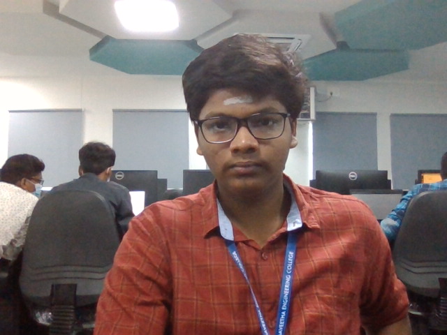
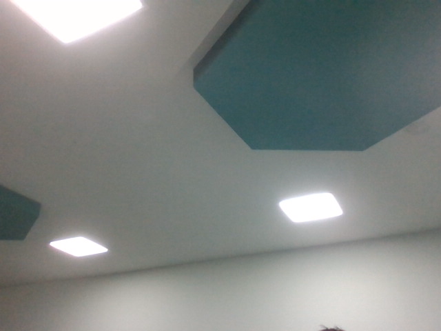
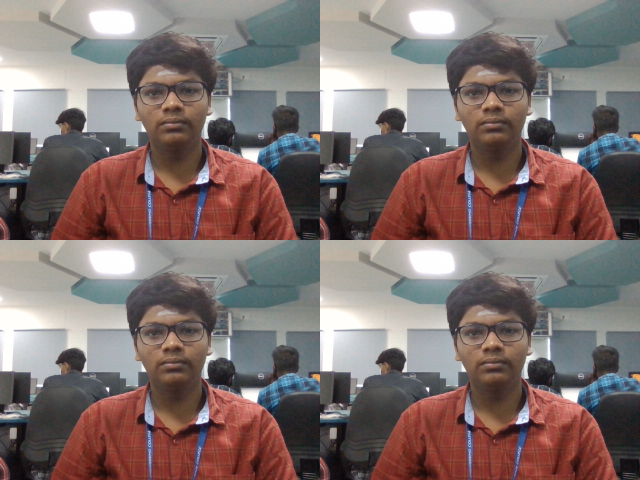
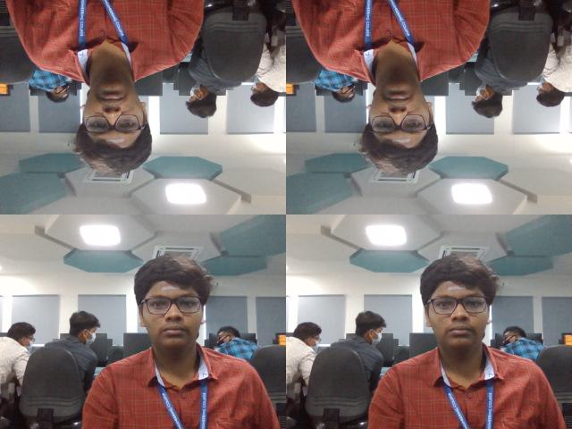

# Image-Acquisition-from-Web-Camera
# AIM:
 To write a python program using OpenCV to capture the image from the web camera and do the following image manipulations.
~~~
i) Write the frame as JPG .
ii) Display the video. 
iii) Display the video by resizing the window.
iv) Rotate and display the video.
~~~
# SOFTWARE USED:

### Anaconda - Python 3.7.

# ALGORITHM:
## STEP 1:

Import Opencv and numpy(selective programs).
## STEP 2:
Using VideoCapture(0), you can capture the picture.

## STEP 3:

Using read() ,you can read the given input through webcam.
## STEP 4:

Using get() or shape() we can divide the screens into many parts.
## STEP 5:
End the Program.

# PROGRAM:

### Developed By: R.SOMEASVAR.
### Register No: 212221230103.

## i) Write the frame as JPG file:
~~~
import cv2
videoCaptureObject=cv2.VideoCapture(0)
while True:
    ret,frame=videoCaptureObject.read()
    cv2.imshow('hai',frame)
    cv2.imwrite("hello.jpg",frame)
    if cv2.waitKey(1)==ord('s'):
        break
videoCaptureObject.release()
cv2.destroyAllWindows()
~~~

## ii) Display the video:
~~~
import cv2
Capture=cv2.VideoCapture(0)
while(True):
    R,Frame=Capture.read()
    cv2.imshow("Frame",Frame)
    if cv2.waitKey(1)==ord('s'):
        break
Capture.release()
cv2.destroyAllWindows()
~~~

## iii) Display the video by resizing the window:
~~~
import numpy as np
import cv2
Capture=cv2.VideoCapture(0)
while(True):
    R,Frame=Capture.read()
    Width=int(Capture.get(3))
    Height=int(Capture.get(4))
    image=np.zeros(Frame.shape,np.uint8)
    smaller_frame=cv2.resize(Frame, (0,0), fx=0.5, fy=0.5)
    image[:Height//2,:Width//2]=smaller_frame
    image[Height//2:,:Width//2]=smaller_frame
    image[:Height//2,Width//2:]=smaller_frame
    image[Height//2:,Width//2:]=smaller_frame
    cv2.imshow("Frame",image)
    if cv2.waitKey(1)==ord('s'):
        break
Capture.release()
cv2.destroyAllWindows()
~~~

## iv) Rotate and display the video:
~~~
import numpy as np
import cv2
Capture=cv2.VideoCapture(0)
while(True):
    R,Frame=Capture.read()
    Width=int(Capture.get(3))
    Height=int(Capture.get(4))
    image=np.zeros(Frame.shape,np.uint8)
    smaller_frame=cv2.resize(Frame, (0,0), fx=0.5, fy=0.5)
    image[:Height//2,:Width//2]=smaller_frame
    image[Height//2:,:Width//2]=cv2.rotate(smaller_frame,cv2.ROTATE_180)
    image[:Height//2,Width//2:]=smaller_frame
    image[Height//2:,Width//2:]=cv2.rotate(smaller_frame,cv2.ROTATE_180)
    cv2.imshow("Frame",image)
    if cv2.waitKey(1)==ord('s'):
        break
Capture.release()
cv2.destroyAllWindows()
~~~
# OUTPUT:

## i) Write the frame as JPG image:

## ii) Display the video:

## iii) Display the video by resizing the window:

## iv) Rotate and display the video:

# RESULT:
Thus the image is accessed from webcamera and displayed using openCV.
